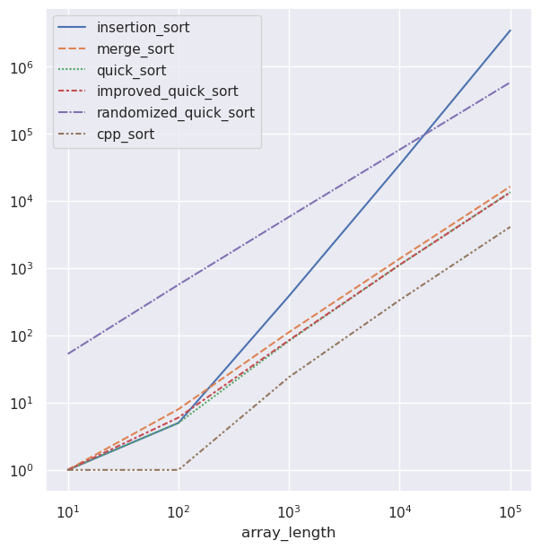

# Project 1: Sorting

## Overview
- The project has implementation of several sorting algorithm: insertion_sort, merge_sort, quicksort, and two variation of quick_sort.

## Structure
* The project contains:
    - The two main files are sorting.hpp and sorting.cpp.
        + sorting.hpp contains all of the functions definitions.
        + sorting.cpp contains all of the functions implementations.
    - The Makefile that compiles the executables.
    - The mytests.cpp file which contains test cases for the created functions.

## Design Decisions
- For both merge and quick sort, we decided to have additional functions instead of incorporating everything into one single function.

## Group Challenges
- The requirement of having only two parameters for each function was difficult to navigate.

## Individual Reflection
- We've split the work evenly so each of us contributed to the implementation of several functions. Personally, I've done:
    + Sorting Algorithms: insertion_sort, merge_sort
    + Runtime_Analysis: created functions to get the run time of the sorting algorithms
    + Documentation

## Known Issues
- The all_run_time() function takes a considerable amount of time to execute, so this should be considered before using it. The real_run_time() line is commented out, but you can remove the comment to run it and see the result.

- Contrary to expectations randomized quicksort, the actual running time of the standard quicksort algorithm is faster than that of the randomized quicksort algorithm with the for arrays with randomized elements.

## Runtime Analysis

* The graph shows the actual runtime of the sorting algorithms for randomly generated arrays with input sizes ranging from 10^1 to 10^6.

    - Insertion sort, with its O(n^2) complexity, takes more time than other algorithms for large test cases.

    - The three functions—merge sort, quicksort, and improved quicksort—do not show a significant difference in execution time.

    - In the improved_quicksort() algorithm, we choose the median of arr[0], arr[mid], and arr[n-1] using a helper function pick_median() with O(1) complexity. As a result, for larger inputs, the algorithm runs slightly faster than regular quicksort.

    - The randomized function takes a significant amount of constant time, so it does not offer any particular advantage over regular quicksort when applied to randomly generated arrays.

    - The C++ sort algorithm also appears to have an upper bound of O(nlogn), but with a significantly smaller constant compared to the O(nlogn) algorithms we wrote.
